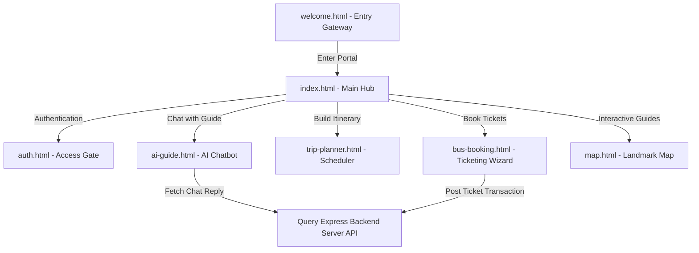

# Siwa Oasis Traveler Hub: Glassmorphic Tourism Client & AI Guide

<div align="center">
  
</div>

<div align="center">
     
</div>

بوابة **عميل واحة سيوة السياحي** هي منصة تفاعلية تتميز بتصميم زجاجي عصري (Glassmorphism) تمكن السياح من حجز تذاكر باصات السفر وتخطيط مسارات الرحلة والتواصل الفوري مع مرشد سياحي ذكي يعتمد على الذكاء الاصطناعي.

This repository houses the high-fidelity responsive traveler frontend client for the **Siwa Oasis Ecosystem**. Built using semantic HTML5, custom HSL glassmorphic variables, and Vanilla JavaScript UI controllers.

---

## 🧬 System Interfaces & Layouts

The traveler client interface provides specialized panels:

1.  **Onboarding Gateway (`welcome.html`)**: Introductory page welcoming tourists with background media and portal links.
2.  **Home Hub (`index.html`)**: Main dashboard detailing tourist landmarks and search functions.
3.  **Auth Panel (`auth.html`, `auth.js`)**: Clean user login, register, and JWT cookie management structures.
4.  **Bus Booking Wizard (`bus-booking.html`, `bus-Booking.js`)**: Multi-step ticket reservation wizard.
5.  **Trip Planner Panel (`trip-planner.html`, `trip-planner.js`)**: Interactive scheduler allowing users to drag and build trip itineraries.
6.  **AI Travel Guide (`ai-guide.html`, `ai-guide.js`)**: Intelligent chat assistant query panel.
7.  **Interactive Map (`map.html`, `map.js`)**: Leaflet/SVG based map pointing to oasis hotels, hot springs, and temples.
8.  **Places Directory (`places.html`, `places.js`)**: Attraction lists detailing historic monuments and safari coordinates.

---

## 🧬 UI Navigation & Interaction Flow

The frontend coordinates multi-panel views and routes:



---

## 🛠️ Technology Stack & Assets

*   **Structure**: Semantic HTML5 markup built for responsive UI.
*   **Design & Theme**: Premium HSL variables and CSS3 backdrop blurs (`backdrop-filter`) creating glassmorphic widgets.
*   **Logic Engine**: Asynchronous Vanilla JavaScript controllers (`fetch/async/await`) communicating with the REST backend api.
*   **Fonts**: Custom Outfit font integration for elegant styling.

---

## 📂 Repository Module Layout

```text
siwa-oasis-traveler-hub/
├── *.css                # Glassmorphic stylesheets per module (trip, map, guide)
├── *.js                 # Custom scripts for wizard logic and API fetching
├── photos/              # Oasis gallery and background graphics assets
├── index.html           # Main traveler dashboard
├── welcome.html         # Portal onboarding gate
├── auth.html            # Authentication layout
├── bus-booking.html     # Tickets wizard layout
├── trip-planner.html    # Trip schedule builder
├── ai-guide.html        # AI Chat assistant panel
├── map.html             # Interactive landmark coordinates map
└── places.html          # Scenic spots directory listing
```

---

## ⚡ Local Setup & Execution

Since the project consists of compiled static assets, it has no package build steps or dev runtime dependencies:

```bash
# 1. Clone the organization repository
git clone https://github.com/Siwa-Oasis-Org/siwa-oasis-traveler-hub.git
cd siwa-oasis-traveler-hub

# 2. Run a local server (e.g. using Python, Live Server, or Nginx)
# Python 3 example:
python -m http.server 8080

# 3. Open http://localhost:8080 in your browser
```

---

## 📄 License
Licensed under the **MIT License**.
